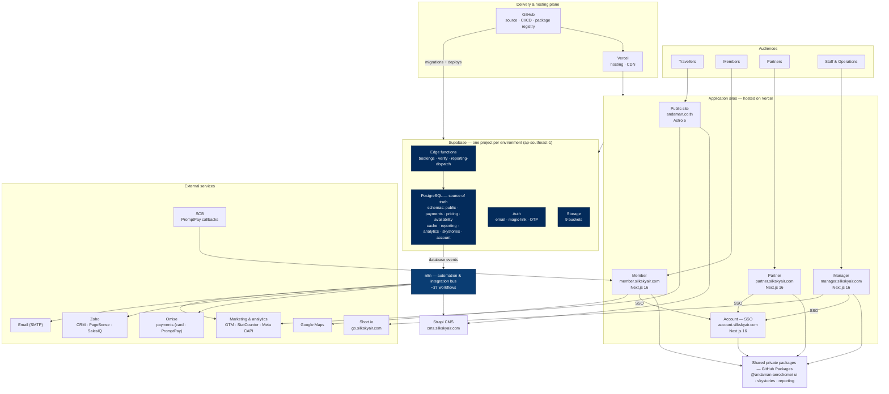
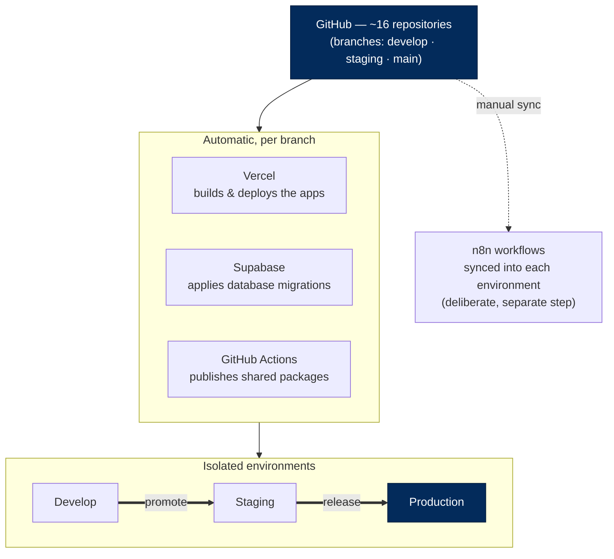
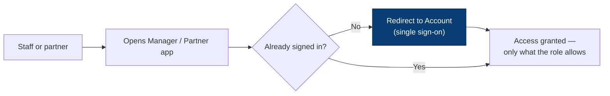

# SilkSkyAir Platform — Architecture Whitepaper

**Andaman Aerodrome Company (AAC)** · Thailand's premium air-mobility platform
**Subject:** Platform architecture & infrastructure  ·  **Date:** June 2026  ·  **Status:** As built

> An architectural introduction to the SilkSkyAir platform — the story of how the system is built, not the business it serves. It maps the application silos, the shared data foundation, the automation that ties them together, and the infrastructure they run on. Technical terms are defined in the glossary; recurring operating costs are inventoried in Section 9.

---

## 1. Abstract

SilkSkyAir is a **cloud-native, multi-application platform** built as a single monorepo of around
sixteen components. Its design follows one consistent idea: **a set of purpose-built applications —
one per audience, each at its own URL — all sit on a single shared data foundation and reach the
outside world through one automation layer.**

The applications are thin, audience-specific front ends. The intelligence lives below them: a single
**PostgreSQL** database (managed by **Supabase**) that is the system's source of truth, a small set of
secure **server-side functions**, and an **n8n** automation layer that acts as the integration bus to
every external service (payments, CRM, content, email, marketing). Everything is hosted on managed
cloud platforms — **Vercel**, **Supabase**, **Strapi Cloud**, **n8n Cloud** — with source code,
continuous integration, and private package distribution on **GitHub**, and runs in three isolated
environments in the Singapore region.

This document introduces that architecture top to bottom.

---

## 2. Architectural principles

A handful of decisions shape everything else in the platform:

- **One application per audience (silos by URL).** Each audience has a dedicated app at its own
  address — public site, members, partners, staff, and identity. This keeps each app small, focused,
  and independently deployable.
- **One shared data foundation.** All apps read and write the same central database. There is one
  source of truth; no app owns its own private copy of the data.
- **Shared building blocks, not copy-paste.** Common UI and data-access code is published as private
  packages and reused across apps, so they stay consistent.
- **Automation as the integration bus.** Apps do not call external services directly. Database events
  flow into **n8n**, which orchestrates every outbound integration. Integrations can change without
  touching app code.
- **Event sourcing for the things that matter.** Bookings, identity, and content changes are recorded
  as an immutable history of events — a built-in, tamper-evident audit trail.
- **Managed cloud over owned servers.** Every layer runs on a managed platform, so a small team can
  operate the system reliably.
- **Three isolated environments.** Develop, Staging, and Production are fully separate, so changes are
  proven before customers ever see them.

---

## 3. The application silos

The platform's front end is **five web applications**, each owning one audience and one URL. Four are
built with **Next.js 16 / React 19**; the public site uses **Astro 5**. All are hosted on **Vercel**.
A sixth address serves the content system (Strapi).

| Silo | Production URL | Built with | Architectural role |
|---|---|---|---|
| **Public site** | `andaman.co.th` · `www.silkskyair.com` | Astro 5 | Storefront — tours, live pricing & availability, booking entry point, marketing analytics |
| **Member** | `member.silkskyair.com` | Next.js 16 | Authenticated customer area — trips, payments, profile; departure maps |
| **Partner** | `partner.silkskyair.com` | Next.js 16 | Authenticated reseller area — bookings, team & commissions |
| **Manager** | `manager.silkskyair.com` | Next.js 16 | Internal operations cockpit — bookings, flights, pricing, partners, content, campaigns, reporting |
| **Account** | `account.silkskyair.com` | Next.js 16 | Identity provider — single sign-on shared across the staff/partner apps |
| **CMS** | `cms.silkskyair.com` | Strapi 5 (Strapi Cloud) | Headless content management for the public site |

Notes that matter architecturally:

- **The public site is content- and conversion-oriented.** Astro renders fast, mostly-static pages;
  its content comes from Strapi, and it carries the platform's marketing analytics (see Section 6).
- **Member, Partner, and Manager are authenticated applications.** They share a design system and
  data-access libraries, and they sign in through **Account** rather than holding their own logins.
- **Manager is the largest silo.** It is the operational surface for the whole business and enforces
  **role-based access** so each staff function sees only what it should.
- **Account is the identity silo.** It exists purely to centralise authentication and session
  management across the other apps.

---

## 4. The complete architecture

The diagram below is the **whole platform on one page** — every silo, the shared foundation, the
automation bus, and the external services. The layers read top to bottom: audiences use the apps; the
apps share private packages and the Supabase foundation; the database emits events to the n8n bus; and
the bus reaches every external service. GitHub and Vercel form the delivery and hosting plane.

**How to read it.** Each audience touches exactly one app. The authenticated apps share private
packages and sign in through Account. Every app relies on the **Supabase** foundation; bookings in
particular go through the secure **`bookings`** function rather than writing the database directly. The
database emits **events** that the **n8n** bus turns into outbound actions — taking payment, syncing
the CRM and the CMS, sending email, and reporting marketing conversions. The rest of the document walks
each layer in turn.

---

## 5. Data & backend foundation

The foundation is **Supabase** — a managed platform that bundles a PostgreSQL database, authentication,
file storage, and server-side functions. There is **one Supabase project per environment**.

### The database — one source of truth
A single **PostgreSQL** database holds all platform data. The schema is sizeable and disciplined: it is
managed through roughly **560 versioned migrations** and organised into clear **schemas** (namespaces)
by domain:

| Schema / domain | Holds |
|---|---|
| `public` (bookings, members, orgs) | Bookings, passengers, members, partners/organisations |
| `payments`, `pricing` | Payment requests/intents, promotions, commissions |
| `availability`, `cache` | Schedule availability and pre-computed caches |
| `skystories` | "Sky Stories" content data layer |
| `reporting`, `analytics` | Report definitions, schedules, runs, analytics |
| `account` | Identity sessions and authentication events |

**Event sourcing.** The critical domains — **bookings**, **identity (account)**, and **content
(skystories)**, along with aircraft and tours — record changes as an **append-only stream of events**.
These event tables are protected against update or delete at the database level, giving the business a
complete, tamper-evident **audit trail** and the ability to reconstruct exactly how any record reached
its current state.

### Server-side functions (edge functions)
Three **edge functions** run trusted logic server-side, next to the database:

- **`bookings`** — the controlled entry point for creating and changing bookings; apps call it rather
  than writing booking tables directly.
- **`verify`** — unified email/identity verification (OTP and signed-token verification).
- **`reporting-dispatch`** — executes scheduled reports and advances their schedule.

### Authentication
Authentication supports **email/password, magic-link, and email OTP**. Phone/SMS sign-up is configured
but disabled; social OAuth (Google/Apple/Facebook) is scaffolded but not yet enabled. Sessions and
sign-in events are recorded in the `account` schema.

### Storage
File storage is organised into **nine buckets**, split by sensitivity — **public** buckets for content
(`tours`, `airfields`, `sky-stories`, `coupons`, `campaigns`, `integrations`) and **private** buckets
for sensitive artefacts (`members`, `bookings`, `reports`).

### Access control
**Row-level security** is enforced in the database, so each user and partner can reach only their own
data. The rules live with the data, not only in the applications.

---

## 6. Automation & integration

The platform deliberately **does not call external services from inside the apps**. Instead, the
database emits events, and a managed **n8n** instance (the *integration bus*) orchestrates everything
that must happen next. Around **37 workflows** are organised by purpose:

| Workflow group | What it does |
|---|---|
| **Bookings** | Creation trigger and lifecycle event routing |
| **Payments** | Omise webhook handling and payment-status updates |
| **CRM sync** | Bidirectional Zoho sync — leads, deals, product catalogue |
| **Transactional email** | Booking, verification, invitation, and magic-link emails |
| **Content sync** | Sky Stories ↔ Strapi (content, media, translations) |
| **Reporting** | Polls for due report schedules and dispatches them |
| **Marketing attribution** | Meta Conversions API purchases and campaign publishing |

**Worked example — a booking.** A request from the public site or partner app calls the **`bookings`**
edge function, which records the booking as events in the database. Those events flow to **n8n**, which
takes payment through **Omise** (with **SCB** handling certain PromptPay/QR callbacks), creates the deal
in **Zoho CRM**, sends the confirmation email, and reports the conversion to **Meta**. Business rules
live in one place; the integrations hang off the bus.

**Content and marketing.** **Strapi** (the headless CMS) feeds the public site's tours, pages, and
stories, and stays in sync with the database through n8n. The public site also carries a pluggable
**analytics** layer that fans events out to **Google Tag Manager**, **StatCounter**, **Zoho
PageSense**, and the **Meta Conversions API**, under a consent gate. **Short.io** (`go.silkskyair.com`)
produces short links and QR codes for campaigns.

---

## 7. Infrastructure, environments & delivery

### Managed cloud
Every layer runs on a managed platform: **Vercel** (app hosting + CDN), **Supabase** (database, auth,
storage, functions), **Strapi Cloud** (content), **n8n Cloud** (automation), and **GitHub** (source,
CI/CD, private packages). The data and compute are hosted in the **Singapore region**
(`ap-southeast-1`), the closest major hub to Thailand.

### Three isolated environments and the release pipeline
Each environment — **Develop**, **Staging**, **Production** — has its own Vercel deployments, its own
Supabase project, its own Strapi Cloud instance, and (for the upper two) its own n8n instance. Changes
flow left to right, and most of the delivery is automatic per branch:

- **Applications** — Vercel builds and deploys each app to the environment matching its branch.
- **Database** — schema changes are **migration files**; on merge, each environment's Supabase project
  applies them automatically. Schema is never changed by hand, so environments stay reproducible.
- **Shared libraries** — GitHub Actions builds and publishes the `@andaman-aerodrome/*` packages to the
  private registry, tagged per branch.
- **Automation** — n8n workflows are the one exception: they are **synced into each environment as a
  deliberate, separate step**, not carried by a code push.

> The cost of this maturity is duplication: the platform effectively runs **three copies** of its core
> services (Supabase ×3, Strapi ×3, n8n ×2). This is inventoried in Section 9.

---

## 8. Security architecture

Security is structural, not bolted on:

- **Single sign-on.** The **Account** silo is the identity provider; the other staff/partner apps hold
  no separate passwords, and access is granted or revoked centrally.
- **Role-based access.** Manager separates finance, operations, and content responsibilities by role.
- **Row-level security.** The database restricts every user and partner to their own data.
- **Payment isolation.** Card data is handled by **Omise**; the platform never stores card numbers.
  Inbound payment webhooks (Omise, and SCB PromptPay callbacks) are **signature-verified**.
- **Environment & secret isolation.** Production data is separate from testing systems, and credentials
  are managed per environment, never committed to code.

---

## 9. Recurring-cost services

The platform pays for a set of **managed third-party services** to operate. They are inventoried here
for completeness; figures are left for Finance.

> **About the numbers:** the cost column is intentionally left blank for **Finance to complete** from
> actual invoices. The engineering team has confirmed *which* services are in use and *what they are
> for*; no dollar figures are estimated. Where a service has a free tier, that is noted.

### A. Core platform & infrastructure (definitely recurring)

| Service | What it's for | How it's billed | Instances / scope | Monthly cost |
|---|---|---|---|---|
| **Vercel** | Hosting & CDN for all 5 web apps | Per project / team seats | 5 apps | `__________` |
| **Supabase** | Database, auth, storage, edge functions | Per project | **3** (develop / staging / production) | `__________` |
| **Strapi Cloud** | Headless CMS for the public site | Per project | **3** (per environment) | `__________` |
| **n8n Cloud** | Automation & integration bus | Per instance / plan | **2** (production + staging) | `__________` |
| **GitHub** | Source code, CI/CD & private package registry | Per user / org plan | Org-wide (~16 repos) | `__________` |
| **Omise** | Card & PromptPay payment processing | **% per transaction** (+ fixed fee) | Live + test | _Varies with sales_ |
| **Domain names** | Web addresses (`silkskyair.com`, `andaman.co.th`) | Annual registration | 2+ domains | `______ / yr` |

### B. Business, marketing & tooling (confirm plan/tier with Finance)

| Service | What it's for | How it's billed | Notes | Monthly cost |
|---|---|---|---|---|
| **Zoho** | CRM, PageSense (analytics), SalesIQ (live chat) | Per user / suite | Multiple Zoho products | `__________` |
| **Google Maps Platform** | Departure maps in the member app | Usage-based (free credit, then per use) | Depends on traffic | `__________` |
| **StatCounter** | Website visitor analytics | Monthly plan (free tier) | Confirm tier | `__________` |
| **Short.io** | Campaign short links & QR (`go.silkskyair.com`) | Monthly plan (free tier) | Confirm tier | `__________` |
| **Notion** | Internal documentation | Per user | Confirm seats | `__________` |

### C. Configured but not currently billing

- **Meta Conversions API** — advertising measurement; **the API is free** (cost is the ad budget, which sits outside the platform).
- **SCB PromptPay callbacks** — bank-side; no platform subscription identified (verify any merchant/bank fees with Finance).
- **Twilio (SMS auth)** — configured in the auth layer but **disabled**; not billing.
- **Mailpit** — local-only email testing; **never billed**.

### Cost summary (for Finance to complete)

| Category | Services | Estimated monthly cost |
|---|---|---|
| Hosting, infrastructure & developer platform | Vercel, Supabase ×3, Strapi ×3, n8n ×2, GitHub | `__________` |
| Payments | Omise | `______` _(varies with sales)_ |
| Sales, marketing & analytics | Zoho, Google Maps, StatCounter, Short.io | `__________` |
| Team tooling | Notion | `__________` |
| Domains | silkskyair.com, andaman.co.th | `______ / yr` |
| **Total recurring** | | **`__________`** |

_Figures to be supplied by Finance from actual invoices. The services listed are confirmed in use by the engineering team._

---

## 10. Glossary

| Term | Meaning |
|---|---|
| **Next.js / React** | Framework and library for the interactive app silos (member, partner, manager, account). |
| **Astro** | Framework for the fast, content-heavy public site. |
| **Monorepo** | All ~16 components live in one coordinated set of repositories. |
| **Private package** | Shared code (e.g. the design system) published privately so every app uses the same version. |
| **Supabase / PostgreSQL** | Managed backend (database, auth, storage, functions) built on the PostgreSQL database. |
| **Schema** | A namespace inside the database that groups related tables by domain. |
| **Edge function** | A small, secure program that runs server-side, next to the database. |
| **Event sourcing** | Recording changes as an immutable sequence of events — a complete audit trail. |
| **Row-level security (RLS)** | Database rules ensuring each user/partner sees only their own data. |
| **n8n** | The automation tool used as the platform's integration bus. |
| **Strapi** | The headless content management system feeding the public site. |
| **Omise / SCB** | Payment gateway (Omise) and bank PromptPay callbacks (SCB). |
| **Zoho** | CRM plus website analytics (PageSense) and live chat (SalesIQ). |
| **Vercel / CDN** | Hosting service and the global delivery network that makes apps fast. |
| **GitHub / CI/CD** | Source code, automated build/test/release, and the private package registry. |
| **Migration** | A recorded database change, applied automatically to each environment. |
| **Environment** | An isolated copy of the platform (Develop / Staging / Production). |

---

## 11. Appendix — components & URL map

### Repositories (≈16 components)

| Component(s) | Role | Type |
|---|---|---|
| `silkskyair-www` | Public site | Astro front end |
| `silkskyair-member`, `-partner`, `-manager`, `-account` | Authenticated apps + identity (SSO) | Next.js front ends |
| `silkskyair-api` | Database, migrations, edge functions | Supabase (PostgreSQL) |
| `silkskyair-cms` | Content management | Strapi 5 |
| `silkskyair-workflows` | n8n automation workflows | Automation |
| `silkskyair-ui`, `-skystories`, `-reporting` | Shared design system, data layer, reporting | Private packages |
| `silkskyair-orchestrator` | Cross-app test & E2E orchestration | Tooling |
| `silkskyair-docs` | This documentation library | Docs |
| `silkskyair-common`, `-config`, `-utils` | Reserved placeholders | (empty) |

### Environment & address map

| Environment | Public site | Apps | Backend |
|---|---|---|---|
| **Production** | `andaman.co.th`, `www.silkskyair.com` | `member.` / `partner.` / `manager.` / `account.silkskyair.com` | Supabase (prod) · Strapi `cms.silkskyair.com` · n8n `andamanaerodrome.app.n8n.cloud` |
| **Staging** | `staging.silkskyair.com` | `staging.*.silkskyair.com` | Supabase (staging) · Strapi Cloud (staging) · n8n (staging) |
| **Develop** | `develop.silkskyair.com` | local / developer machines | Supabase (develop) · Strapi Cloud (develop) · local n8n |

---

_Prepared by the Platform / Engineering team for Andaman Aerodrome Company. Describes the platform as
built and running as of June 2026. Recurring-cost figures in Section 9 are to be completed by Finance._
