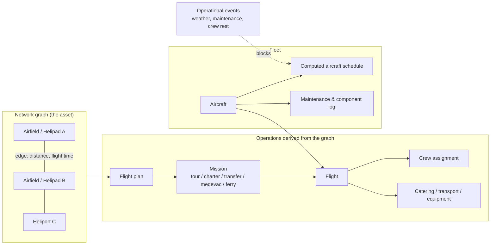

# The Network Platform

> **Working title:** Andaman Aerodrome Network Platform (**AANP**). The name designates the
> core, operator-neutral layer of the system; it is a working title and can be re-branded
> without any technical change.

## What the platform fundamentally is

AANP is the **digital operating system for a network of helipads, heliports and aircraft**.
It is not a booking website with a flight database attached — it is the inverse: a complete
aviation network management core, on top of which commercial products (tours, charters,
transfers) are merely one category of consumer.

Everything an organization needs to **own, operate and expand a vertical-flight network**
is a first-class citizen of the data model:

| Network capability | Platform implementation |
|---|---|
| Helipads / heliports / airfields | `airfields` — location, timezone, contact, metadata |
| Route network between sites | `airfield_network_edges` — distance, flight time per leg |
| Aircraft fleet | `aircraft` — registration, model, capacity, default crew/components |
| Fleet maintenance & service log | `aircraft_events`, `aircraft_components` |
| Route planning | `flight_plans` — departure/arrival airfield, waypoints, duration |
| Work orders for any aviation activity | `missions` — typed: tour, charter, transfer, medevac, ferry |
| Scheduled operations | `flights` — aircraft, status lifecycle, departure time |
| Crew management | `flight_crew` — pilots, co-pilots, engineers, medics per flight |
| Flight logistics | `flight_components` — catering, ground transport, equipment |
| Network-wide disruptions | `operational_events` — maintenance, weather, crew rest, inspections |

All of these live in the production database of `silkskyair-api` today (migrations
`20251230300*` onward), protected by dedicated access privileges
(`module:network:*`, `module:scheduling:*`) that separate network operations from every
commercial concern.

## The network is the graph; everything else follows

The model is deliberately graph-shaped: **airfields are nodes, network edges are routes**,
and every flight the platform ever schedules is derived from that graph.

The consequence for expansion is structural: **adding a heliport to the network is a data
operation, not a software project.** A new node plus its edges immediately participates in
route planning, scheduling, availability and every commercial product downstream.

## The scheduling and availability engine

The platform continuously answers the hardest operational question in vertical flight —
*"which aircraft can be where, when, with whom on board?"* — automatically:

- **`scheduler_rebuild`** recomputes every aircraft's schedule (missions, ferry legs,
  returns, maintenance windows) for a time window. It runs nightly via `pg_cron` and is
  re-triggered immediately when bookings, network edges or maintenance events change.
- **Availability computation** enforces operational rules in real time: operational-event
  blackouts (per aircraft, per airfield, per crew member), booking cutoffs, join-flight
  cutoffs for shared flights, and seat-capacity checks — before any commercial logic runs.
- **A dedicated cache layer** (`cache` schema: month calendars, per-date slots) keeps
  availability queries fast at consumer-traffic volumes, with automatic invalidation when
  operational or pricing data changes.

This engine is operator-neutral. It schedules *missions* — a tour for a commercial brand,
a medevac, a ferry flight and a private charter are the same kind of object to the core.
That neutrality is what makes the platform a **turn-key solution for aviation activities**
in general, rather than a tour-sales system.

## Mission types: the full span of aviation activities

`mission_types` is an open taxonomy. The platform ships with:

| Type | Activity |
|---|---|
| `tour` | Scheduled sightseeing products (the SilkSkyAir showcase — see [case study](07-case-study-silkskyair.md)) |
| `charter` | Private on-demand flights |
| `transfer` | Point-to-point passenger transport between network nodes |
| `medevac` | Medical evacuation operations |
| `ferry` | Repositioning flights, automatically planned by the scheduler |

New activity types (cargo, survey, training, agricultural work) are additive rows, not new
modules — the scheduling, crew, maintenance and disruption machinery applies unchanged.

## Operational integrity by design

- **Event-sourced records** — operational state changes append events rather than
  overwrite rows, producing a complete audit trail (see
  [Platform Asset Value](06-platform-asset-value.md) for the compliance argument).
- **Role-segregated access** — network and scheduling functions are guarded by
  database-enforced privileges (`rls_has_privilege('module:scheduling:manage')` and
  related policies), so commercial users can never touch operational data.
- **Disruption handling as data** — an `operational_event` with a scope (aircraft,
  airfield or crew member) instantly and consistently blocks availability across every
  commercial channel, with no coordination required between teams.

## Why this layer is the company's primary asset

1. **It encodes the physical network.** The helipads, heliports, routes and aircraft —
   the assets new management intends to own, expand and operate — have a one-to-one
   digital representation that is already running in production.
2. **It is activity-agnostic.** Tours are one of five mission types. The same core can
   operate transfers, medevac and charter businesses the day they are commercially
   relevant.
3. **It compounds.** Every node added to the graph increases the value of every other
   node (more routes, more products, more utilization options) — the classic network
   effect, captured in a schema built for it.
4. **It is separable.** The commercial features documented in the
   [next chapter](03-commercial-services.md) sit *on top of* this layer and can be
   white-labelled to any number of operators — see
   [White-Label Separation](04-white-label-separation.md).

---

*Next: [Commercial Services — value added on the network base](03-commercial-services.md)*
