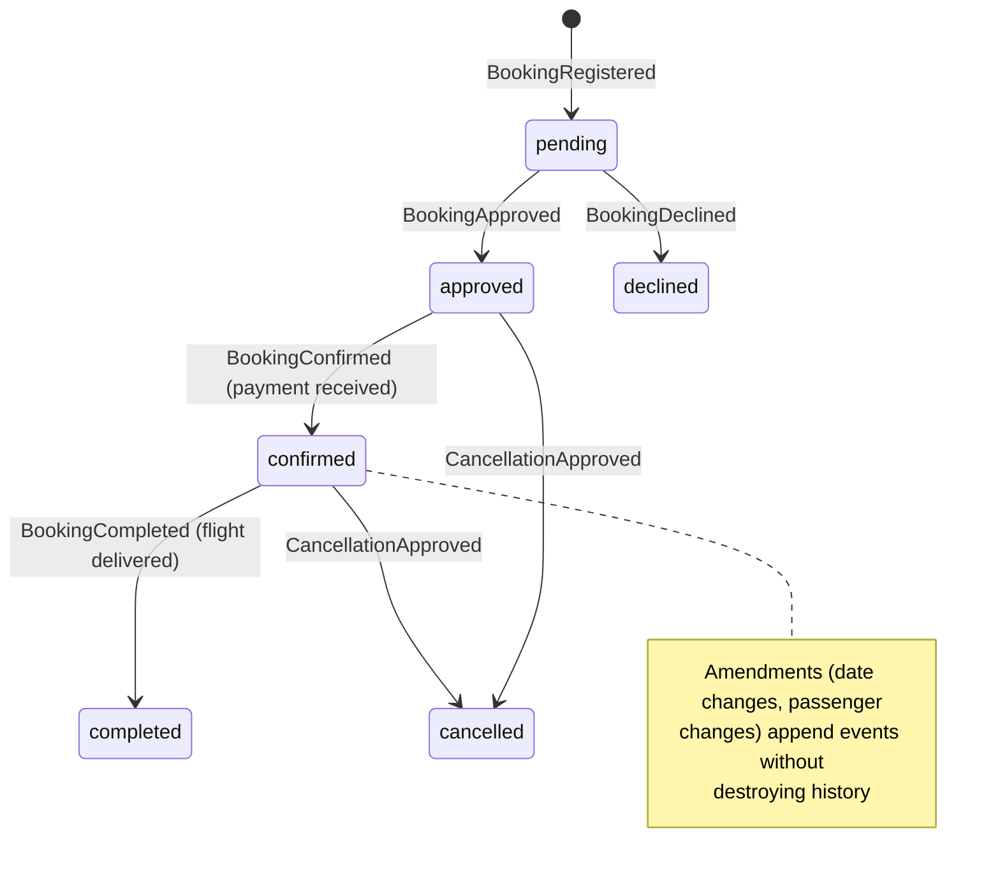

# Commercial Services — Value Added on the Network

The commercial layer turns network capacity into revenue. It is a **complete,
production-grade commerce stack** — catalog, dynamic pricing, bookings, payments,
customers, resellers and marketing — built strictly *on top of* the network core described
in [The Network Platform](02-network-platform.md). Nothing in this chapter is required for
the network to operate; everything in this chapter monetizes it.

This separation is the basis of the platform's white-label strategy: the entire layer can
be offered, as a package, to any commercial operator on the network
(see [White-Label Separation](04-white-label-separation.md)).

## The commercial stack at a glance

| Capability | Platform implementation |
|---|---|
| Product catalog | `tours` (+ `tours_i18n` translations, `tour_media`, departure points via `tour_airfields`) |
| Base & seat pricing | `tour_pricing` — per aircraft, seat capacity, shared-flight discounting |
| Real-time availability & quotes | availability engine + `cache` schema (operational rules first, pricing second) |
| Bookings | `bookings` + event-sourced lifecycle (`booking_events`, 40+ event types) |
| Line-item pricing | `booking_price_components` — base, share discount, promotion, coupon, private premium, surcharge, tax |
| Passenger manifests | `booking_passengers` — including per-passenger weight for flight safety |
| Add-on sales | `ancillary_items`, `booking_ancillary_items` (meals, transfers, insurance) |
| Payments | `payments` schema + `payment_intents` — Omise cards, SCB PromptPay QR, refund workflow |
| Customer identity | `member_profiles` (canonical, email-keyed), accounts, sessions, lifecycle events |
| Reseller network | `organizations` (type `partner`), commissions & settlement (`booking_commission_settlements`) |
| Marketing | `pricing.promotions`, `coupons`, `campaigns` (QR codes, landing pages), SkyStories editorial content |
| Reporting | `reporting` schema — SQL-template report engine with scheduled partner dispatches |

## Dynamic pricing, computed not configured

Every quoted price is assembled from explicit components at query time:

1. **Base** — `tour_pricing.base_amount` per seat for the assigned aircraft.
2. **Shared-flight discount** — automatic discount when a passenger joins an existing
   shareable flight, increasing load factor on already-committed capacity.
3. **Promotions** — time-boxed, scope-aware campaigns (`pricing.promotions`: percent,
   fixed or ancillary; constrained by booking window and travel window).
4. **Coupons** — redemption-coded discounts with usage limits and full audit
   (`coupon_redemptions`), optionally restricted to specific organizations.

Each component is persisted per booking as a `booking_price_components` line item —
positive charges, negative discounts, with source references. The commercial ledger of any
booking is therefore **self-explanatory and audit-ready**, and new pricing strategies
(dynamic premiums, partner-tier pricing) are additive component types.

## Event-sourced bookings: the lifecycle is the audit trail

Booking status is never stored as a mutable field. It is **derived from an append-only
event log** (`booking_current_status()` over `booking_events`):



More than forty event types cover registration, approval, payment, amendment requests and
approvals, cancellation and refund workflows, partner attribution and completion. The
commercial benefit:

- **Disputes are resolvable from the record** — who changed what, when, is always known.
- **Compliance posture** — regulators and auditors get a tamper-evident history for free.
- **Workflow automation** — every event is a webhook trigger for the n8n workflow engine
  (confirmation emails, manager alerts, CRM sync, payment capture).

## Payments and settlement

- **Multi-provider checkout** — Omise (cards) and SCB PromptPay (QR) are integrated
  end-to-end: `payment_intents` tracks tokens, sources and charges per attempt;
  provider webhooks reconcile status automatically. The platform stores no card data
  (tokenized, PCI-aligned).
- **Payment requests & refunds** — `payments.payment_requests` and
  `payments.booking_refund_requests` formalize money movement as workflow objects with
  status taxonomies, not ad-hoc operations.
- **Partner commissions** — bookings attributed to a reseller organization settle through
  `organization_bookings` and `booking_commission_settlements`: per-organization commission
  percentages, computed amounts, settlement status. The model already supports both
  settlement directions used in the field (operator-collected and partner-collected), with
  Thai VAT and withholding-tax mechanics implemented.

## Customers as durable assets

`member_profiles` is a canonical, email-keyed customer identity that accumulates across
channels: bookings, sessions, lifecycle events, marketing consent, acquisition source
(first and latest). Members can affiliate with organizations (`member_organizations`) —
the foundation for employee, affiliate and franchise relationships. The customer base is
thus a **structured, portable asset**, not rows scattered across a booking table.

## Marketing and content built in

- **Campaigns** — landing pages, short links and QR codes (`campaigns`, Short.io
  integration), published to the CMS automatically.
- **SkyStories** — an editorial subsystem (dedicated `skystories` schema: entities, media
  with video hosting, keywords, tour associations, engagement events) powering
  content-led acquisition.
- **Internationalization throughout** — a dedicated `i18n` schema plus companion
  translation tables (`tours_i18n`, `promotions_i18n`, `campaigns_i18n`, …). English and
  Thai are live; Russian and Chinese are provisioned in the locale model. New markets are
  content work, not engineering work.

## Why "value added" is the right frame

Every capability above consumes the network core and adds margin on top of it:

```
network capacity (AANP)  →  products (tours/charters/transfers)  →  channels (web, members,
partners)  →  payments & settlement  →  customer relationships  →  repeat revenue
```

The layer is comprehensive enough to run a real business today — demonstrated by
[SilkSkyAir, the first operator](07-case-study-silkskyair.md) — and modular enough to be
replicated for the next operator without touching the network core.

---

*Next: [White-Label Separation — one network, unlimited operators](04-white-label-separation.md)*
