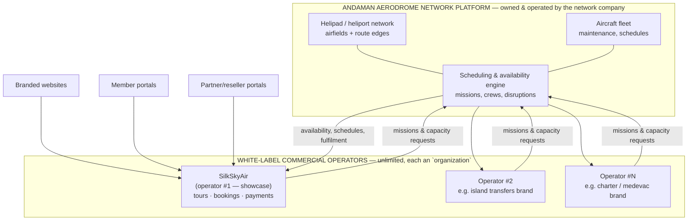

# White-Label Separation — One Network, Unlimited Operators

This chapter shows **how the platform divides into a network platform plus an unlimited
number of white-label commercial operators** — and why that division is a configuration of
mechanisms that already exist in production, not a re-architecture.

## The target operating model



The network company runs the base layer and sells **capacity plus a turn-key commercial
suite**. Each commercial operator gets, under its own brand: a storefront, a booking
engine with dynamic pricing, customer and reseller portals, payment rails, marketing
tooling and reporting — while the network company retains the helipads, aircraft,
scheduling and operational control.

## The separation already exists in the schema

The division is not a roadmap item. The mechanisms are in the production database today:

### 1. Organizations are the tenant unit

- `organizations` is a first-class entity with a **type taxonomy**
  (`organization_types`: `partner`, `operator` — extensible by row insert), its own
  branding fields (name, slug, logo, contact), geographic scope
  (`organization_countries`), and a per-organization `commission_percent`.
- `organization_user_roles` and `organization_identity_roles` give every organization its
  own staff, roles and permissions.
- `organization_invitations` provides self-service team onboarding per tenant.

### 2. Database-enforced isolation

- Row-Level Security policies gate every sensitive table through privilege checks
  (`rls_has_privilege('module:…:access' / ':manage')`, `rls_is_platform_admin()`)
  — 44 migrations build out this policy layer.
- The privilege namespace is **module-shaped** (`module:network:*`,
  `module:scheduling:*`, `module:bookings:*`, `module:partners:*`), which maps exactly
  onto the network/commercial boundary: network privileges stay with the network company;
  commercial privileges are granted per operator organization.

### 3. Commercial flows are already organization-scoped

- `organization_bookings` ties bookings to an organization with its own commission and
  settlement status; `booking_commission_settlements` computes and audits the money split.
- `coupon_organizations` scopes marketing instruments to a tenant.
- `member_organizations` affiliates customers with organizations — with a database trigger
  enforcing one active partner affiliation per member.

### 4. The application layer is modular per audience

- The back office (`silkskyair-manager`) is built on a **module registry** — 26 registered
  modules (network, scheduling, bookings, pricing, promotions, partners, payments,
  reporting, …) whose visibility is controlled by the same `module:*` privileges. A
  network-company console and an operator console are *permission profiles over the same
  codebase*, not separate products.
- Customer-facing apps (`silkskyair-www` storefront, `silkskyair-member` portal,
  `silkskyair-partner` reseller portal) consume the shared backend through the same APIs
  and are themeable via the shared UI library (Tailwind theme) and CMS-driven content —
  the standard white-label recipe: same engine, per-brand skin and content space.
- The `i18n` schema is **context-aware** (per-application contexts with their own locale
  sets), so each branded deployment carries its own copy and languages.

## What "onboarding operator #2" actually involves

Because the mechanisms exist, onboarding a new commercial operator is a provisioning
checklist, not a development project:

| Step | Mechanism | Nature |
|---|---|---|
| 1. Create the tenant | Insert `organizations` row (type, branding, commission terms) | Data |
| 2. Provision staff | `organization_user_roles` + module privileges (commercial set only) | Data |
| 3. Define the catalog | Tours/charters/transfers referencing network airfields & capacity | Data + content |
| 4. Brand the channels | Deploy storefront/member/partner apps with operator theme + CMS space | Configuration |
| 5. Connect money | Payment provider account per operator; settlement terms in org record | Configuration |
| 6. Go live | Availability, scheduling and fulfilment served by the shared network core | — |

The marginal cost of each additional operator approaches the cost of configuration and
content — the defining economics of a platform business.

## Degrees of separation, selectable per strategy

The same design supports three increasingly strong separation models, in order of effort:

```timeline
Level 1 | Logical separation — available now | All tenants in one deployment, isolated by organizations + RLS + module privileges. Right for onboarding speed.
Level 2 | Branded-channel separation — available now | Per-operator storefront and portal deployments over the shared core; the applications are independently deployable today.
Level 3 | Corporate separation — structural option | Network tables, commercial tables and applications are already partitioned by schema, privilege namespace and repository, so the platform can be split into two products owned by two entities — the network platform and a commercial-suite licensee. This is what lets the company divide the platform cleanly if the network and commercial businesses are ever held or sold separately.
```

## SilkSkyAir: tenant #1 as proof

SilkSkyAir is not "the platform" — it is the **first commercial operator built on it**,
exercising every white-label surface end-to-end in production: branded storefront, member
portal, partner/reseller network with commission settlement, two payment providers, CRM
integration and multilingual content. The full walk-through is in the
[case study](07-case-study-silkskyair.md).

Its strategic role in this document is evidentiary: **everything an operator licensee
would buy has already been built, integrated and operated for a real business.**

---

*Next: [Architecture — modern and modular by design](05-architecture.md)*
