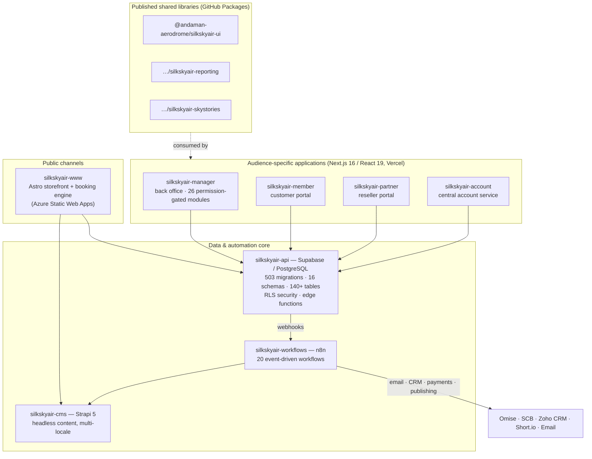

# Architecture — Modern and Modular by Design

The platform is built the way contemporary, venture-grade software is built in 2026:
**small, independently deployable applications around a strongly-governed data core, with
event-driven automation and serverless operations.** This chapter documents the technical
substance behind the claims of modernity and modularity.

## Platform topology

## A modern stack, end to end

| Layer | Technology | Why it matters to an investor |
|---|---|---|
| Frontends | Next.js 16 / React 19 / Tailwind CSS 4; Astro for the storefront | Current-generation frameworks; large hiring pool; long support runway |
| Data core | PostgreSQL on Supabase (managed) | Industry-standard database; no proprietary lock-in; portable by design |
| Security | Row-Level Security enforced **in the database** | Tenant isolation cannot be bypassed by application bugs |
| Automation | n8n workflow engine | Integrations are visual, auditable workflows — not buried code |
| Content | Strapi 5 headless CMS | Marketing iterates without engineering involvement |
| Hosting | Vercel, Azure Static Web Apps, Supabase Cloud, Strapi Cloud | Fully serverless: no servers owned, near-zero ops headcount, elastic scaling |
| Delivery | Git-based CI/CD, staging/production environments, E2E test orchestration (Playwright/Vitest) | Professional release discipline, verifiable in the repositories |

## Modularity, demonstrated at four levels

**1. Repository level.** The estate is 19 focused repositories — 8 deployable
applications/services, 3 published libraries, plus orchestration, environment and
documentation repos. Each piece versions, deploys and scales independently; none is a
monolith that must be bought, sold or operated as an all-or-nothing block.

**2. Schema level.** The database is partitioned into 16 purpose-named schemas —
network and operations (`operations`, `availability`, `workflows`, `cache`), commerce
(`pricing`, `payments`, `partners`, `members`), growth (`analytics`, `reporting`,
`skystories`), platform (`i18n`, `account`, `api`, `geo`) and `public` core. Domain
boundaries are visible in the database itself, which is what makes the
[white-label separation](04-white-label-separation.md) credible.

**3. Application-module level.** The back office is a **module registry**: 26 modules
(network, scheduling, bookings, pricing, promotions, partners, payments, campaigns,
reporting, integrations, …), each gated by a `module:*` database privilege. Product
packaging — which tenant sees which capability — is configuration.

**4. Component level.** Shared UI, reporting and content libraries are published as
versioned packages and consumed by the apps like any third-party dependency. New
applications (e.g. a future operator console for a licensee) start from a proven kit
rather than from zero.

## Event-driven by default

State changes in the core publish events; the workflow engine reacts:

- Booking registered → pricing components written, payment request raised, manager
  notified, CRM lead/deal created (Zoho).
- Payment webhook (Omise) → charge reconciled, booking confirmed, customer emailed.
- Campaign published → landing page pushed to CMS, short link + QR code generated.
- Nightly → aircraft schedules rebuilt (`pg_cron`), scheduled reports dispatched to
  partners.

The pattern means new integrations (a channel manager, an accounting system, a
government reporting feed) attach to existing events — they do not require changes to the
core.

## Built for more than one market from day one

- Dedicated `i18n` schema with per-application contexts and per-context locale sets;
  translation companion tables across the catalog and marketing entities. English and
  Thai live in production; Russian and Chinese provisioned.
- Multi-currency-ready pricing fields; timezone-aware airfields and scheduling.
- Geography as data (`geo` schema, organization country scoping).

## Engineering discipline as a due-diligence artifact

The repositories themselves are the evidence room:

- **503 incremental migrations** — every schema change reviewed, ordered and reproducible
  from zero.
- **Seed and environment tooling** — a complete local environment (`silkskyair-supabase`)
  with 30 dependency-ordered seed files; staging and production separation with documented
  promotion paths.
- **E2E orchestration** — a dedicated orchestrator repo running Playwright suites across
  all applications.
- **Operational documentation** — staff manuals, release compilations and weekly
  engineering reports in this repository.

A technical due-diligence team can verify every claim in this document directly against
the codebase — which is precisely how this document was produced.

---

*Next: [Platform Asset Value](06-platform-asset-value.md)*
