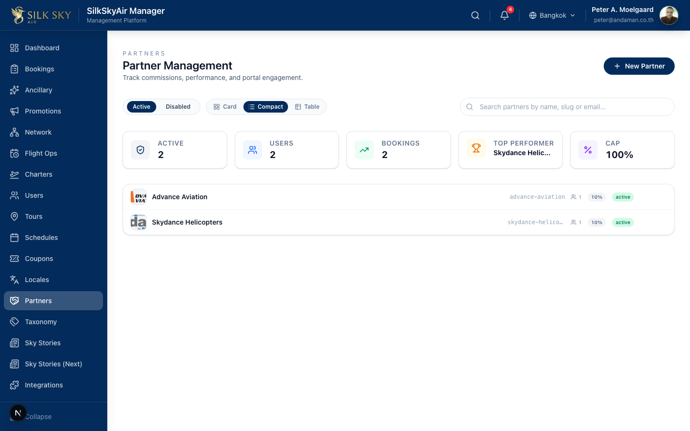
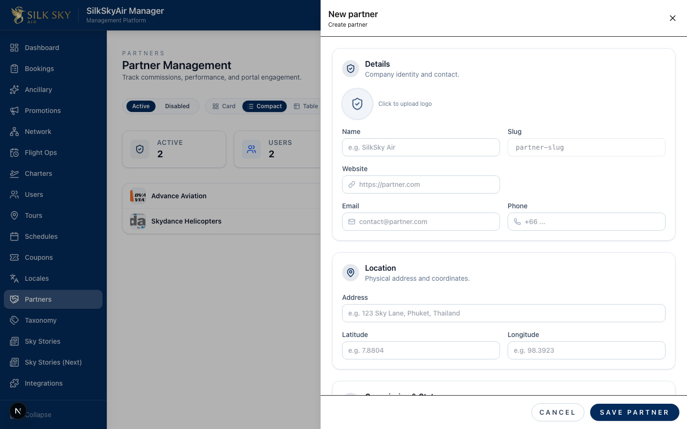
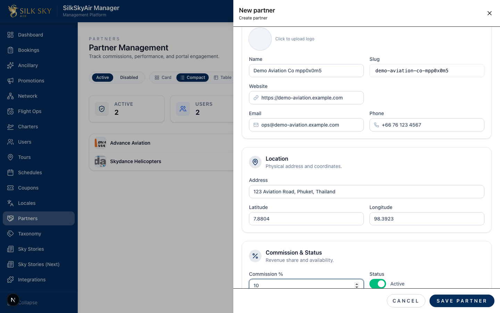
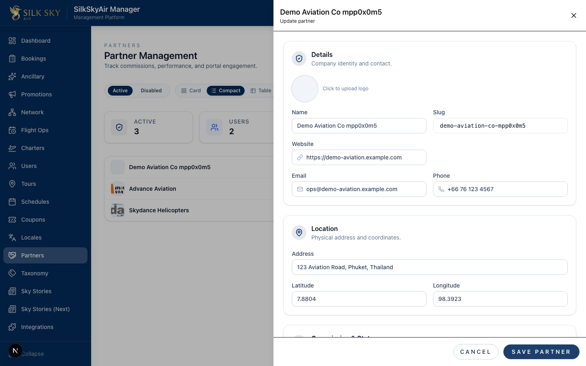
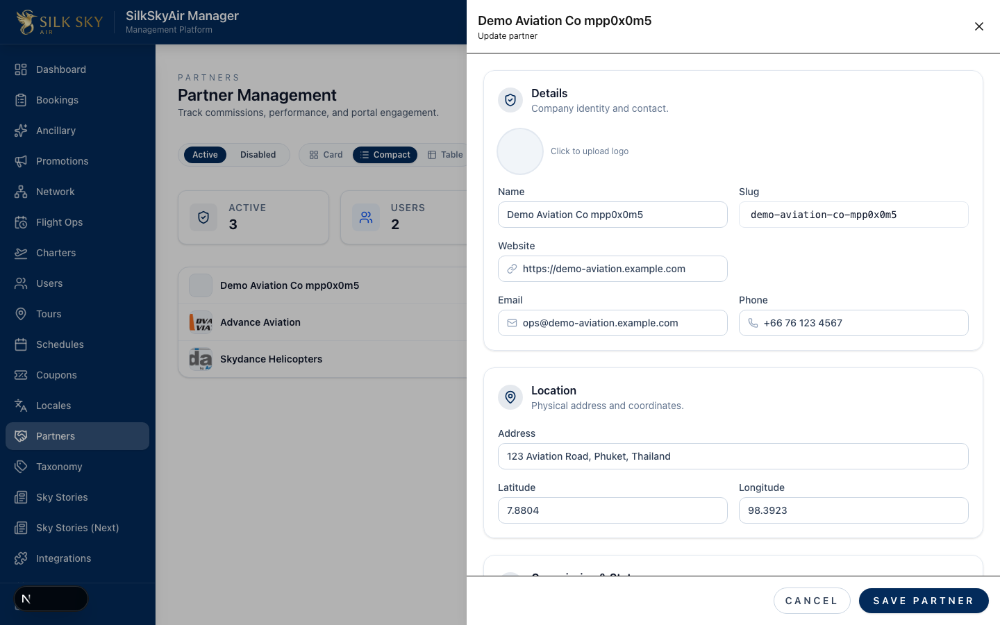

# Create a Partner (Back-office)

> **App:** BackOffice (Manager)
> **Who uses it:** Ops staff with the `module:partners:access` privilege.
> **What it does:** Walks you through creating a new partner organization end-to-end — opening the create drawer, filling every field, saving, verifying what landed, and re-opening the record later from the partners list.

## Before you start

- **Local URL:** `http://localhost:3000/partners` (staging / production: the same path on the relevant Manager host).
- **Account:** Sign in with a Manager account that has the partners module enabled (e.g. `peter@andaman.co.th` on local).
- **Optional:** a small image file you'd like to use as the partner's logo. Any common format (PNG, JPG, SVG) works.

## Step-by-step

### Step 1 — Open the Partners page

Navigate to `/partners` from the sidebar.

**What you should see:** the Partner Management page with the existing partners listed, headline counters (Active, Users, Bookings, Top Performer, Cap), and a **+ New Partner** button at the top right.

### Step 2 — Open the create drawer

Click **+ New Partner**. The drawer slides in from the right.

**What you should see:** an empty drawer titled "New partner" with a "Create partner" subtitle, an X close button on the right, and form sections for Details, Location, Commission & Status, and (further down) Countries / Team. The Save Partner CTA sits in a footer pinned to the bottom of the drawer.

### Step 3 — Fill the form

Fill in the partner's information:

- **Name** — required. The Slug auto-fills from the Name as you type.
- **Logo** — click the round avatar at the top of the Details card to pick a file.
- **Website**, **Email**, **Phone** — contact info.
- **Address**, **Latitude**, **Longitude** — physical location and map coordinates.
- **Commission %** — share you award to this partner on each booking.

**What you should see:** every field populated with the values you typed, the Logo avatar showing your uploaded image, and the status badge defaulting to Active.

### Step 4 — Save

Click **Save Partner** in the bottom-right footer.

**What you should see:** three things at once —

1. The drawer **stays open** (it does NOT auto-close). The header now reads the partner's name with an "Update partner" subtitle — you're now in edit mode.
2. Every field you just typed is still showing.
3. The URL gains `?partner=<id>` (visible in the address bar). Refreshing the page from here will re-open the same record.

The new partner also appears in the list behind the drawer.

If you have unsaved changes and try to close the drawer (X / Escape / clicking the backdrop), you'll get a confirm dialog asking whether to discard. Right after a successful save there are no unsaved changes, so closing is silent.

### Step 5 — Come back to the partner later

Close the drawer (X, Escape, or backdrop) — since the form is no longer dirty, it closes cleanly. Then click the partner's row in the list to reopen the record.

**What you should see:** the drawer reopens in edit mode with every value you saved earlier. The round-trip is honest — close, navigate, reopen, and the record is intact.

## Tips & common questions

- **The drawer didn't close after I clicked Save.** That's intentional (W23 F1.1 R1) — it lets you verify what was saved without re-finding the row. Use the X / Escape / backdrop to close when you're done.
- **I clicked X but got an "Unsaved Changes" dialog.** You have edits that haven't been saved yet. Click **Discard** to lose them and close, or **Keep Editing** to cancel the close.
- **I want to send an invitation to the partner's first manager at the same time.** Scroll to the bottom of the drawer before saving — there's an "Invite first manager" toggle. Fill the title/name/email and the invitation is sent along with the save.
- **The Save button is disabled.** Name is required; make sure it's filled. If it still won't save, check the toast / status message below the buttons.
- **Where do countries go?** Countries can only be added *after* the partner exists. Save first, then the Countries section unlocks for adding country rows with VAT rates.
